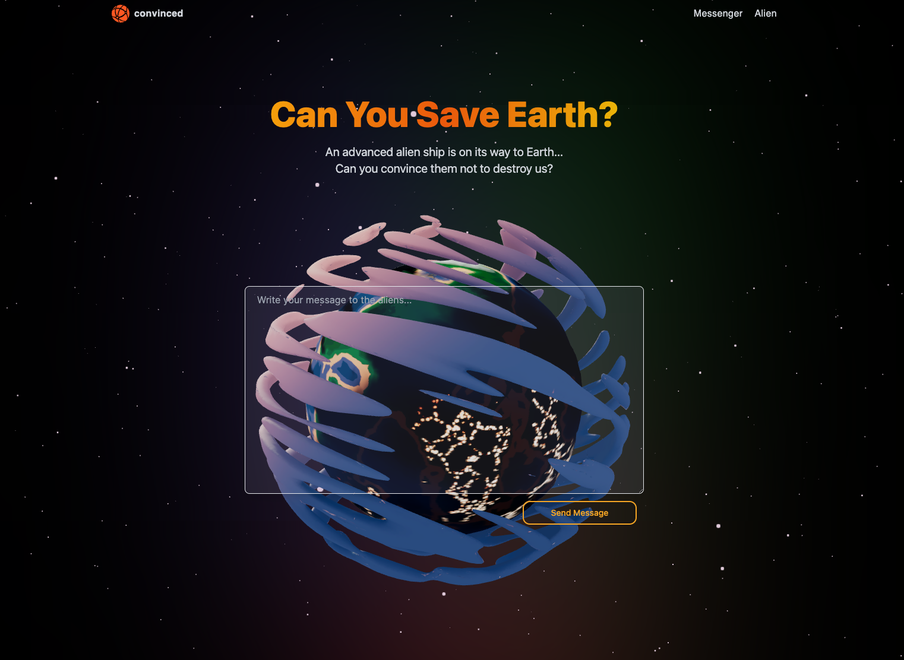

# Convinced.app

**This project is designed to showcase an MVP of a creative writing game.**

The goal is to challenge users to write using different creative writing techniques and systems in order to improve and pass the test.



## :alien: MVP Initial Scenario :alien:

The initial scene is an alien (named Blorgon) approaching earth in order to destroy it. Blorgon has been destroying worlds with life for many years – at the request of his superiors. You are able to send a single message to Blorgon as he approaches Earth, which must convince him to spare us (at the risk of being punished by his bosses or our species threatening his in the future).

**Hints:**

- *Use empathy to think about Blorgon’s situation – because he is unlikely to care what we’re doing here on Earth.*
- *Focus on the future, explaining what life would be like for him if he destroys Earth and if he doesn’t.*
- *Edit your work! Make it engaging and exciting to read (as it will be public for others to see).*

## Feedback Loop

As ChatGPT (or any other model that could be swapped in) is pretty terrible at understanding if something is good writing, convincing (or not) (otherwise it’d just write better itself), it is important to find a meaningful feedback loop to collect and generate labelled data ourselves with minimal effort on our side.

**This is a critically important feature that allows us to:**

- *Fine-tune or train our own model*
- *Create a data moat – making it harder for others to copy, giving us a competitive advantage.*
- *Use the data in additional ways – like analytics, feedback, suggestions, marking and new scenarios.*

As a result, the `Alien` tab/page (found at the top right) flips the scenario and puts the user in the Alien seat. It then shows 2 messages from the database that previous users have submitted and allows the user to pick which one is more convincing. (There is also a report option to remove bad responses.) The answer is updated in the database (using a log table and a snapshot table), before 2 new responses are drawn.

Using the elo formula (from chess), when a user votes for a given response, the comparative difference in their current score determines how many points the vote awards the chosen response. This allows for fine-tune changes when 2 responses close to each other are selected, and a large step when they are further apart. As a result, the responses from others are ‘labelled’ by stack rank (best to worst and removed/reported) and ready to be fed into the model for training – creating a feedback loop.

## Future Feature Set Ideas

Currently, there is no plan to continue building features for this project. It was a great way for me to learn Next.JS. But, I want to focus on python, backend, ML and AI. Unfortunately, the future map I created for this project requires too much front-end development for me to continue building it alone. If you’re a software engineer, and interested in developing out this project with me – please reach out.

### Core Expansion Feature

Transform the single scenario into a 5-level path. Something like:

1. Convince Blorgon not to destroy earth (current)
2. Befriend Blorgon through a back-and-forth chat
3. Get Blorgon to divulge a secret piece of tech
4. A scenario dependant on if the secret was tricked out of Blorgon or given willingly.
5. Blorgon’s home world has discovered his defiance… They have allowed you to speak in his defence. Speak (using a mic) to the 12 judges on his home world, presenting a consise argument as to why the policy to seek out and destroy all planets with life is wrong – and how Blorgon’s defiance specifically can positively benefit their world.

**Additional feature ideas as part of core expansion feature:**

- If user fails, allow them to login/create account to save progress and try again – otherwise start from beginning again.
- If that’s too harsh, maybe just require login to access level 5. (And save progress if they want to come back later)
- Users have to convince us (as the devs) to allow them to sign up.
- MVP for signup feature would just be saving their email (for future updates) and allowing them to set a nickname so the AI can call them by name.

### Further Feature Set Ideas

By focusing on different dimensions of communication, we are able to build endless scenarios focused on different skills, ability and people. Explore dimensions of:

- **Age:** *kids in school, kids at uni, adults in the workforce, retired people etc.*
- **Situation:** *real life, fictional (by us), within another’s fictional world.*
- **Audience:** *a single person, a room full of people, a governing body, a group of friends.*
- **Communication Purpose:** *persuade/convince, inform, inspire/motivate, entertain (story).*
- **Communication Mode:** *writing, speaking, acting/non-verbal.*
- **Communication Format:** *letter, speech, guide, debate, social post, blog… etc*
- **Communication Technique:** *subtlety, rule of 3, exaggeration, rhetorical question, metaphor etc.*

[Future Project Expansion Milestones](./FutureIdeas.md)

## :computer: Local Deployment

***Note:** developed and deployed on ARM architecture (M1 chip), so you may need to adapt things for your system. Even the docker containers contain arm64 specific packages.*

### :dizzy: For development of a single component

Simply run: `bash devstart.sh` command in backend or frontend - if they dont need to talk to each other.

### :star2: Development together via docker-compose

Simply run: `bash start.sh` command in root and follow the prompts. Or:

1. Set environment variables (bash commands):
   - `export API_KEY=anything` set any variable here as it's just used for them to talk to each other.
   - `export AI_KEY=<OpenAI Key>` this one requires your personal OpenAI key
2. Run `docker-compose build` to create the containers (ensure docker-daemon is running).
3. Run `docker-compose up` to start the 2 services.
4. Backend head to: [localhost:8000/docs](http://localhost:8000/docs) to see the SwaggerAPI
5. Frontend head to: [localhost:3000](http://localhost:3000) for the homepage.

### :star: Development singularly or together via docker

***Note:** You can also run each container separately with **`docker build`** and **`docker up`** or **`docker start backend`|`frontend`** in each directory.*

1. Create two `.env` file. One in the backend folder and one in the frontend folder:

``` bash
# backend folder .env file
API_KEY=Whatever you want so that backend and frontend talk to each other.
AI_KEY=<Your OpenAI API key>
```

``` bash
# frontend folder .env file
API_KEY=Same as above value
NEXT_PUBLIC_API_KEY=Same as above value
```

2. cd into either folder and run `docker build`
3. Run `docker up` or `docker start backend`|`frontend` to start that service
4. cd into the other folder and repeat steps 2 and 3.

## Contribution, Past and Future

Frontend adapted from: [Arian Hajdin](https://jsmastery.pro/masterclass) (sadly stripped a lot of the functionality out - like the log in code, that could've been used after the MVP :/ haha).

Rest of was all me! :smile:

Interested in contributing? Feel free to [reach out!](mailto:alexljenkins89@gmail.com)
